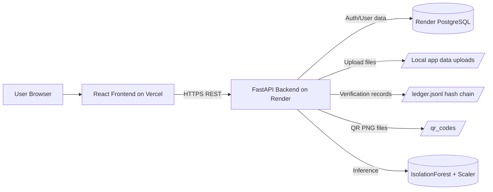
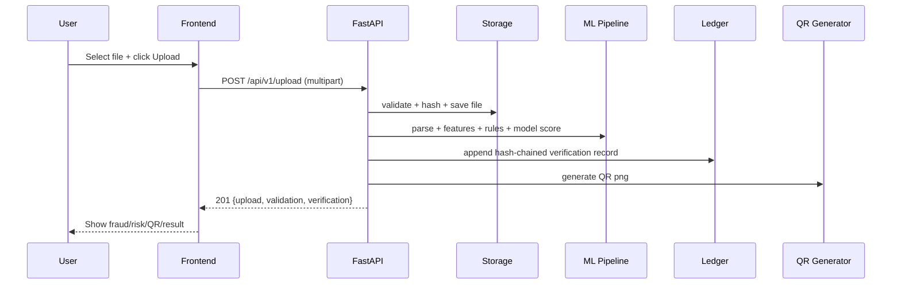
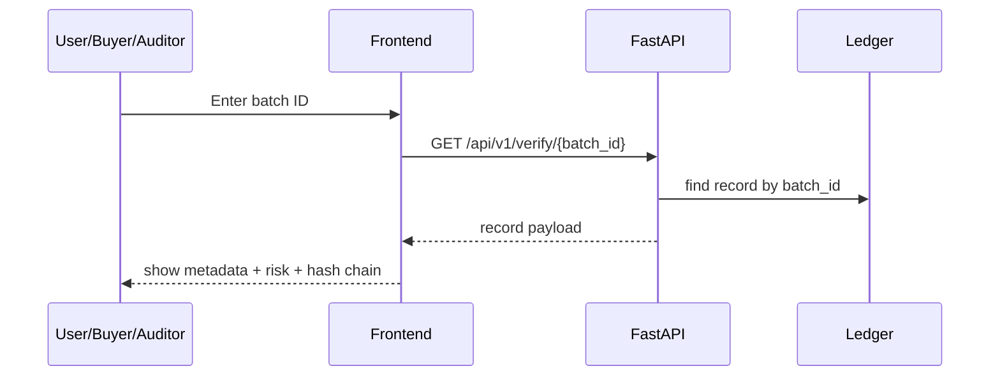
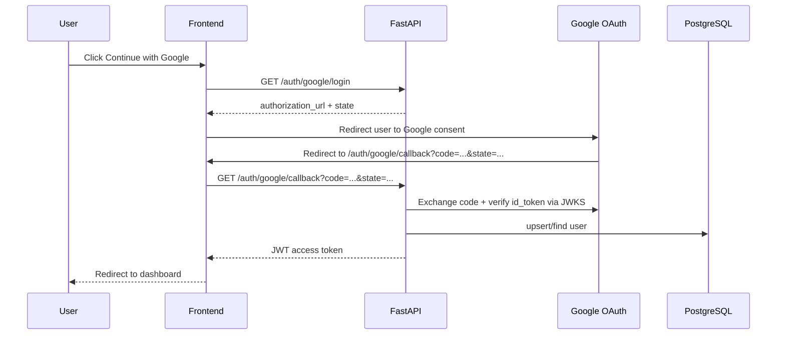

# VeriPura Technical Report (Beginner-Friendly)

Last updated: 2026-02-17
Repository: /Users/vaibhavithakur/veripura-system

## 1. What this project is

VeriPura is a full-stack web system for food supply-chain document verification.

At a high level, it does 4 things:

1. Accepts document uploads (PDF/image/CSV).
2. Uses an ML + rule pipeline to score fraud/anomaly risk.
3. Stores tamper-evident verification records (hash-chained ledger).
4. Lets anyone verify a batch through a public endpoint and QR code.

It also has authentication (email/password + Google OAuth) for user access and dashboard flow.

## 2. One-sentence architecture

Frontend (React on Vercel) calls Backend API (FastAPI on Render), which runs parsing + ML scoring, writes a hash-chained ledger record on disk, generates QR, and uses PostgreSQL for user/auth data.

## 3. System architecture diagram

## 4. Repository structure (what each part does)

- `/Users/vaibhavithakur/veripura-system/backend`
  - FastAPI app, ML pipeline, storage, ledger, auth, DB models/migrations.
- `/Users/vaibhavithakur/veripura-system/frontend`
  - React app, auth pages, upload/verify pages, consistency graph UI.
- `/Users/vaibhavithakur/veripura-system/docs/openapi.json`
  - API schema export.

## 5. Backend deep dive

### 5.1 App startup lifecycle

Entry point:
- `/Users/vaibhavithakur/veripura-system/backend/app/main.py`

On startup, backend:
1. Loads settings from environment.
2. Logs environment and paths.
3. Verifies PostgreSQL connectivity (`SELECT 1`).
4. Preloads ML model + scaler from disk.

On shutdown:
- Disposes SQLAlchemy engine cleanly.

### 5.2 Configuration and environment

Config file:
- `/Users/vaibhavithakur/veripura-system/backend/app/config.py`

Key behaviors:
- Fails fast if `DATABASE_URL` missing.
- Fails fast if `JWT_SECRET` missing.
- Supports `postgresql://...` and converts internally to async SQLAlchemy URL.
- Handles `sslmode` query params and maps to asyncpg-compatible connect args.
- Creates required directories (`/app/data/uploads`, `/app/models`, `/app/data`).

Important env vars:
- `DATABASE_URL`
- `JWT_SECRET`
- `JWT_ALGORITHM` (default HS256)
- `JWT_EXPIRE_MINUTES` (default 1440)
- `GOOGLE_CLIENT_ID`
- `GOOGLE_CLIENT_SECRET`
- `GOOGLE_REDIRECT_URI`

### 5.3 API routing layer

Routes:
- `/Users/vaibhavithakur/veripura-system/backend/app/routes/upload.py`
- `/Users/vaibhavithakur/veripura-system/backend/app/routes/verify.py`
- `/Users/vaibhavithakur/veripura-system/backend/app/routes/shipments.py`
- `/Users/vaibhavithakur/veripura-system/backend/app/routes/qr.py`
- `/Users/vaibhavithakur/veripura-system/backend/app/routes/auth.py`
- `/Users/vaibhavithakur/veripura-system/backend/app/routes/health.py`

The route handlers are thin and call service classes. This is good separation of concerns.

### 5.4 Upload + validation pipeline (core business flow)

Main upload endpoint:
- `POST /api/v1/upload`

Implementation path:
1. Route receives multipart file (`upload.py`).
2. `DocumentService.process_upload()` validates:
   - max size
   - allowed extension
   - mime checks
3. `StorageService.save_file()`:
   - computes SHA-256 hash
   - deduplicates if hash already exists
   - saves to sharded path
4. `MLPipeline.validate_document()`:
   - parse text (PDF/image/CSV)
   - OCR fallback for scanned PDF/image
   - extract numeric/quality/structure features
   - apply rule engine
   - run IsolationForest anomaly detection
   - compute fraud score and risk level
   - extract structured fields (batch_id/exporter/quantity/dates/certificate_id)
5. `VerificationService.record_verification()`:
   - generates new `BATCH-YYYYMMDD-XXXXXX`
   - appends immutable ledger entry with previous hash link
   - generates QR code
6. API returns combined response:
   - upload metadata
   - validation summary
   - verification record metadata

### 5.5 ML internals

Files:
- `/Users/vaibhavithakur/veripura-system/backend/app/ml/parser.py`
- `/Users/vaibhavithakur/veripura-system/backend/app/ml/features.py`
- `/Users/vaibhavithakur/veripura-system/backend/app/ml/rules.py`
- `/Users/vaibhavithakur/veripura-system/backend/app/ml/pipeline.py`
- `/Users/vaibhavithakur/veripura-system/backend/app/ml/model_loader.py`

Model approach:
- IsolationForest + StandardScaler.
- 18 engineered text/document features.
- Hybrid scoring: ML anomaly score + rule penalties.

Fraud score behavior:
- ML decision score is converted via sigmoid to 0-100 risk-like value.
- Rule violations add severity penalties.
- Any critical rule can force risk level to `critical`.

Important practical note:
- OCR for scanned PDFs is intentionally limited to first page in current code (`free tier optimization`).
- This can reduce extracted context and can increase false positives.

### 5.6 Ledger and tamper evidence

File:
- `/Users/vaibhavithakur/veripura-system/backend/app/infra/ledger.py`

Current ledger model:
- Append-only JSON Lines file (`ledger.jsonl`).
- Each record stores `previous_hash` and `record_hash`.
- Integrity endpoint recomputes hashes and chain linkage.

This provides tamper evidence, but it is not yet an external blockchain integration.

### 5.7 QR generation

File:
- `/Users/vaibhavithakur/veripura-system/backend/app/infra/qr_generator.py`

Behavior:
- QR encodes verification URL: `/api/v1/verify/{batch_id}`
- Generated as PNG and stored in sharded directories.
- Can be downloaded or returned as base64.

### 5.8 Consistency graph

Endpoint:
- `GET /api/v1/shipments/{shipment_id}/consistency-graph`

Files:
- `/Users/vaibhavithakur/veripura-system/backend/app/routes/shipments.py`
- `/Users/vaibhavithakur/veripura-system/backend/app/services/verification_service.py`

Current behavior:
- Reads recent records from ledger (`get_all_records(limit=10000)`).
- Groups related records by matching extracted `batch_id`.
- Builds graph nodes:
  - document nodes
  - entity nodes (`batch_id`, `exporter`, `quantity`, `dates`, `certificate_id`)
- Builds edges with:
  - `type`: `MATCH` or `MISMATCH`
  - `field_name`
  - human-readable explanation

Note: despite having PostgreSQL tables for shipments/documents/logs, this graph is currently computed from ledger records, not relational DB rows.

### 5.9 Authentication and authorization

Files:
- `/Users/vaibhavithakur/veripura-system/backend/app/routes/auth.py`
- `/Users/vaibhavithakur/veripura-system/backend/app/services/auth_service.py`
- `/Users/vaibhavithakur/veripura-system/backend/app/auth/security.py`
- `/Users/vaibhavithakur/veripura-system/backend/app/auth/google_oauth.py`

Local auth:
- Register: creates user with bcrypt-hashed password.
- Login: verifies password and returns JWT access token.
- `/auth/me`: validates bearer token and returns user profile.

Google OAuth:
1. `/auth/google/login` builds Google auth URL with scopes `openid email profile` + signed state.
2. Frontend redirects to Google.
3. Google returns `code` to callback route.
4. Backend exchanges code for token using Google token endpoint.
5. Backend verifies `id_token` signature via Google JWKS (cached in memory), checks audience and issuer.
6. User is created or updated, then JWT access token is issued.

### 5.10 PostgreSQL + SQLAlchemy + Alembic

DB files:
- `/Users/vaibhavithakur/veripura-system/backend/app/db/models.py`
- `/Users/vaibhavithakur/veripura-system/backend/app/db/session.py`
- `/Users/vaibhavithakur/veripura-system/backend/alembic/env.py`
- `/Users/vaibhavithakur/veripura-system/backend/alembic/versions/20260215_0001_initial_schema.py`
- `/Users/vaibhavithakur/veripura-system/backend/alembic/versions/20260216_0002_user_auth_fields.py`

Tables:
- `users`
- `shipments`
- `documents`
- `verification_logs`

Current real usage:
- `users` is actively used by auth flows.
- `shipments`, `documents`, `verification_logs` exist in schema but upload/verification flow still primarily uses file ledger and not DB persistence.

## 6. Frontend deep dive

### 6.1 Frontend shell and routing

Main files:
- `/Users/vaibhavithakur/veripura-system/frontend/src/main.jsx`
- `/Users/vaibhavithakur/veripura-system/frontend/src/App.jsx`

Routes implemented:
- `/auth`
- `/auth/google/callback`
- `/dashboard`
- `/upload`
- `/verify`
- `/verify/:batchId`

`/dashboard` is protected by client-side token check (`PrivateRoute`).

### 6.2 API client design

Files:
- `/Users/vaibhavithakur/veripura-system/frontend/src/api/client.js`
- `/Users/vaibhavithakur/veripura-system/frontend/src/api/services.js`

Behavior:
- Axios instance with base URL from `VITE_API_BASE_URL`.
- Request interceptor auto-attaches `Authorization: Bearer <token>` if token exists.
- Centralized service functions for upload, verify, graph, auth endpoints.

### 6.3 Auth UX

Files:
- `/Users/vaibhavithakur/veripura-system/frontend/src/pages/AuthPage.jsx`
- `/Users/vaibhavithakur/veripura-system/frontend/src/pages/GoogleCallbackPage.jsx`
- `/Users/vaibhavithakur/veripura-system/frontend/src/pages/DashboardPage.jsx`
- `/Users/vaibhavithakur/veripura-system/frontend/src/auth/token.js`

Flow:
- Login/signup form with loading/error states.
- Google button calls backend login URL endpoint, then browser redirect.
- Callback page exchanges `code` with backend and stores token.
- Token is stored in localStorage key `veripura_access_token`.

### 6.4 Upload and verify UX

Files:
- `/Users/vaibhavithakur/veripura-system/frontend/src/pages/UploadPage.jsx`
- `/Users/vaibhavithakur/veripura-system/frontend/src/components/FileUpload.jsx`
- `/Users/vaibhavithakur/veripura-system/frontend/src/components/UploadResult.jsx`
- `/Users/vaibhavithakur/veripura-system/frontend/src/pages/VerifyPage.jsx`
- `/Users/vaibhavithakur/veripura-system/frontend/src/components/ConsistencyGraph.jsx`

Behavior:
- Upload page handles drag/drop or file picker.
- On success, shows risk metrics, record hash snippet, QR image link.
- Verify page fetches public ledger record by batch ID.
- Consistency graph is rendered as custom SVG:
  - green edges for match
  - red edges for mismatch
  - click edge to show explanation

## 7. End-to-end request flows

### 7.1 Upload flow

### 7.2 Public verification flow

### 7.3 Google login flow

## 8. Data model summary

### 8.1 User model (auth)

Core fields:
- `id` (UUID)
- `email` (unique)
- `hashed_password` (nullable for Google users)
- `role` enum (`ADMIN`, `IMPORTER`, `EXPORTER`, `LAB`)
- `is_active`
- `auth_provider` (`local` or `google`)
- `google_sub` (Google subject id, unique nullable)
- `created_at`

### 8.2 Verification record model (ledger)

Each ledger entry stores:
- `batch_id`
- `timestamp`
- `file_id` (file hash)
- `document_metadata`
- `validation_result`
- `previous_hash`
- `record_hash`

This gives tamper-evident traceability.

## 9. Deployment architecture (current)

### 9.1 Frontend (Vercel)

Config:
- `/Users/vaibhavithakur/veripura-system/frontend/vercel.json`

Rewrites:
- `/api/*` -> Render backend
- `/health` -> Render backend
- `/(.*)` -> `/` (SPA fallback for client routes)

### 9.2 Backend (Render)

Config:
- `/Users/vaibhavithakur/veripura-system/backend/Dockerfile`
- `/Users/vaibhavithakur/veripura-system/backend/render.yaml`

Container behavior:
- Installs dependencies.
- Runs training script during build (with placeholder env vars for build-time only).
- Starts uvicorn binding to `${PORT}`.

## 10. Important technical realities (very important for you to explain)

1. There are two persistence layers right now:
   - PostgreSQL for users/auth.
   - Local file-based ledger/uploads/QR for verification artifacts.

2. On Render free tier, local filesystem is ephemeral unless a persistent disk is attached.
   - This means ledger/uploads/QR can be lost on restart/redeploy.
   - This is a major production reliability risk for audit continuity.

3. The consistency graph currently reads ledger data, not relational shipment/document tables.
   - So Postgres shipment tables are present but not yet the source of truth for that feature.

4. Fraud score can skew high if parsing quality is poor.
   - Example: OCR only first page + strict rule penalties + synthetic model baseline.

## 11. Known gaps / risks

### 11.1 Data durability risk

- Verification ledger in local container file can disappear after deploy/restart on free tier.
- If investor asks "is it durable?", honest answer is: "tamper-evident yes, durable only if persistent storage is configured."

### 11.2 Incomplete DB adoption for core workflow

- Upload/verification path is not fully persisted in `shipments/documents/verification_logs` tables.
- This is a current architecture mismatch between schema and runtime behavior.

### 11.3 Model maturity

- Current training starts from synthetic data.
- Without enough real labeled data and calibration, risk scores can be unstable/over-sensitive.

### 11.4 Auth hardening still minimal

- No refresh tokens.
- Access token stored in localStorage (simple but vulnerable to XSS if frontend compromised).
- Good MVP choice, but should be hardened for production.

## 12. How to explain this project in an interview/demo (simple script)

Use this script:

"VeriPura is an AI-powered food compliance verification platform. A user uploads supply-chain documents, the backend extracts content using OCR and parsing, computes anomaly risk with a hybrid ML + rules engine, and records each result in a hash-chained immutable-style ledger. Every verified batch gets a QR code so buyers and auditors can check traceability instantly through a public endpoint. We also added secure authentication with JWT and Google OAuth."

Then add:

"Today, auth data is in PostgreSQL, while verification records are in a tamper-evident JSONL ledger. The next production step is moving verification artifacts into persistent storage and making Postgres the full source of truth for shipment/document analytics."

## 13. How to run locally (technical checklist)

Backend:
1. `cd /Users/vaibhavithakur/veripura-system/backend`
2. `poetry install`
3. Create `.env` with DB + JWT + Google values.
4. `poetry run alembic upgrade head`
5. `poetry run python scripts/train_model.py`
6. `poetry run uvicorn app.main:app --reload`

Frontend:
1. `cd /Users/vaibhavithakur/veripura-system/frontend`
2. `npm install`
3. Set `VITE_API_BASE_URL` (local backend URL).
4. `npm run dev`

## 14. Glossary (beginner quick reference)

- API: The backend endpoints the frontend calls.
- JWT: Signed token used to prove logged-in identity.
- OAuth: Login via external identity provider (Google).
- JWKS: Public keys used to verify Google token signatures.
- Alembic migration: Versioned SQL schema change.
- AsyncSession: Non-blocking DB session in FastAPI.
- IsolationForest: Unsupervised anomaly detection algorithm.
- OCR: Optical Character Recognition (image/PDF to text).
- Hash chain: Each record stores previous record hash to detect tampering.
- Ephemeral disk: Data disappears when container restarts.

## 15. Final technical assessment

You have built a strong, demo-ready MVP with real engineering depth:
- End-to-end upload/validate/verify UX
- OCR + ML + rules pipeline
- Tamper-evident verification history
- Public traceability and QR flows
- JWT + Google OAuth auth system
- SQLAlchemy + Alembic database foundation

The biggest production upgrade now is persistence architecture alignment:
- Make verification artifacts durable across redeploys.
- Move shipment/document verification source-of-truth to PostgreSQL (or persistent object storage + DB index).

That one upgrade will significantly increase investor confidence because it converts a strong MVP into a reliable platform foundation.
